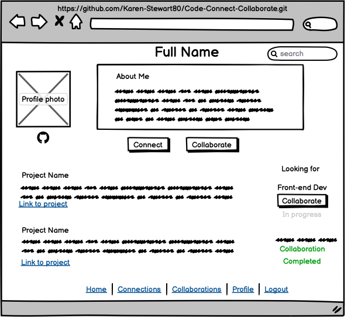

# Code-Connect-Collaborate

### TrelloBoard https://trello.com/b/dVMJvb08/code-connect-collaborate
### Description

This social/work app allows developers to connect and collaborate with other developers on projects. Each developer has a brief profile with photo, their project description/link and what they are looking for eg. Front-end Dev. Easy 'Let's collaborate' and 'Let's connect' buttons allow messaging to begin.

 ### Instructions
 
**Install python 3.9**\
$ apt-get install python3.9

**Clone repository**\
$ git clone https://github.com/Karen-Stewart80/Code-Connect-Collaborate.git

**Change directory into app**\
$ cd Code-Connect-Collaborate

**Install venv**\
$ pip install venv

**Create virtual environment**\
$ python3.9 -m venv venv

**Activate virtual environment**\
$ source venv/bin/activate

**Install dependencies**\
$ pip install -r requirements.txt

**Run app**\
$ python src/main.py

### Wireframes

 